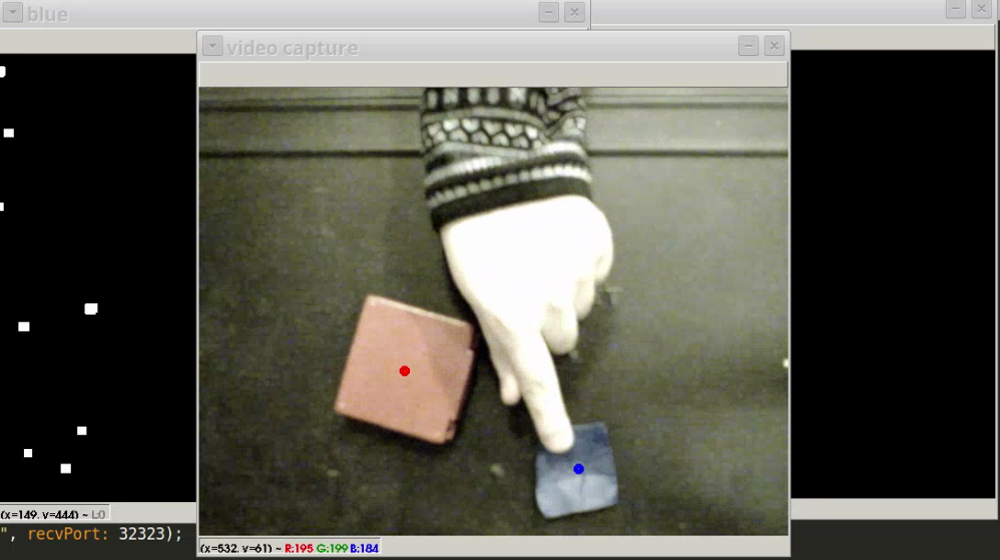

# CV_PyColorCtrl
experiments in sending osc messages corresponding to differently colored objects

- **Python 3** requires `opencv-python` (OpenCV 4.0), and `python-osc`

## Components
- **cvcontrol.py** - detects blue and red objects so far and sends osc messages out on port `32323`
- **osc_test.py** - test reception of osc messages with tags `/red`, `/blue`, etc.

## LICENSE
gpl v 3
